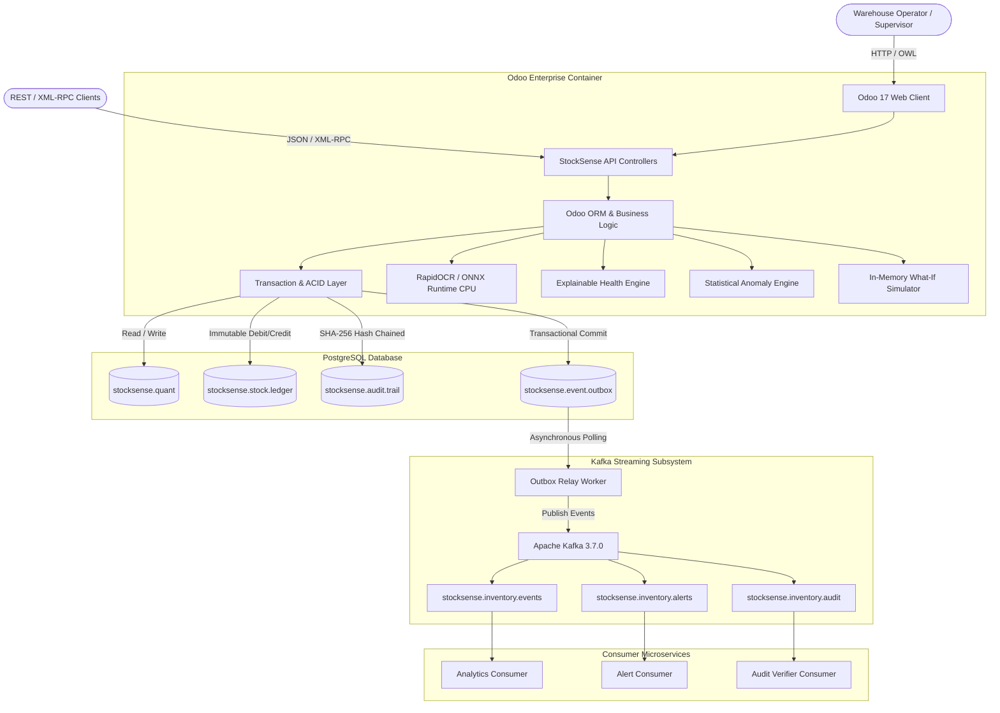

# StockSense — Intelligent Inventory Management & Operational Decision Support System

[](https://www.odoo.com)
[](https://www.python.org)
[](https://www.postgresql.org)
[-red.svg)](https://kafka.apache.org)
[](https://github.com/RapidAI/RapidOCR)
[-success.svg)](https://github.com/PrasannaPichu/Odoo-StockSense)
[](https://github.com/PrasannaPichu/Odoo-StockSense)
[](LICENSE)

> *"Don't just record inventory. Understand what is happening to inventory."*

---

## Table of Contents
1. [Executive Summary](#1-executive-summary)
2. [Problem Statement & Target Users](#2-problem-statement--target-users)
3. [Design Philosophy: Why StockSense?](#3-design-philosophy-why-stocksense)
4. [Problem Statement Coverage](#4-problem-statement-coverage)
5. [Core Features Matrix](#5-core-features-matrix)
6. [System Architecture](#6-system-architecture)
7. [Technology Stack](#7-technology-stack)
8. [Repository & Module Structure](#8-repository--module-structure)
9. [Relational Data Models](#9-relational-data-models)
10. [End-to-End Operational Lifecycle](#10-end-to-end-operational-lifecycle)
11. [Inventory Transaction Workflows](#11-inventory-transaction-workflows)
12. [Double-Entry Stock Ledger](#12-double-entry-stock-ledger)
13. [OCR-Assisted Document Intake (Human-in-the-Loop)](#13-ocr-assisted-document-intake-human-in-the-loop)
14. [Explainable Inventory Health Engine](#14-explainable-inventory-health-engine)
15. [Deterministic & Statistical Anomaly Detection](#15-deterministic--statistical-anomaly-detection)
16. [Sandboxed In-Memory What-If Simulator](#16-sandboxed-in-memory-what-if-simulator)
17. [Warehouse Flow & Velocity Matrix](#17-warehouse-flow--velocity-matrix)
18. [Tamper-Evident SHA-256 Audit Trail](#18-tamper-evident-sha-256-audit-trail)
19. [Kafka Event Streaming & Outbox Pattern](#19-kafka-event-streaming--outbox-pattern)
20. [REST & XML-RPC APIs](#20-rest--xml-rpc-apis)
21. [Security & Access Control](#21-security--access-control)
22. [Command Center UI & Responsive Layout](#22-command-center-ui--responsive-layout)
23. [Docker Deployment & Operations](#23-docker-deployment--operations)
24. [Automated & Browser Verification](#24-automated--browser-verification)
25. [Master Evaluator Demonstration Walkthrough](#25-master-evaluator-demonstration-walkthrough)
26. [Video Recording Checklist & Script](#26-video-recording-checklist--script)
27. [Code Navigation Guide for Evaluators](#27-code-navigation-guide-for-evaluators)
28. [Engineering Principles & Non-Goals](#28-engineering-principles--non-goals)

---

## 1. Executive Summary

Traditional Enterprise Resource Planning (ERP) inventory modules act as **passive digital recording systems**. They capture when goods arrive, move between bays, or leave with a courier, but they fail to interpret what those movements mean for the health and reliability of operations. Discrepancies surface weeks later during painful cycle counts; stock-outs create emergency re-order scrambles; and warehouse supervisors have little visibility into how minor delays cascade through the supply network.

**StockSense** transforms the Odoo 17 inventory platform into an **active, event-driven operational decision-support system**.

Built natively inside Odoo using Python, OWL (Odoo Web Library), and PostgreSQL, integrated with an asynchronous **Apache Kafka** event streaming backbone, and powered by an **Explainable Inventory Health Engine** and local **RapidOCR** intake pipeline, StockSense pairs transactional rigor with predictive, explainable intelligence:

1. **Transactional Single Source of Truth:** PostgreSQL and the Odoo ORM maintain absolute ACID determinism for all quantities, reservations, and double-entry ledger entries.
2. **Decoupled Real-Time Streaming:** Operational changes emit structured domain events to Apache Kafka without delaying or destabilizing transactional commits.
3. **Deterministic Explainable Health:** Every SKU receives continuous health evaluation based on four explicit operational factors (Availability, Runway, Inbound Replenishment, Physical Stability) with plain-English causal diagnoses.
4. **Isolated What-If Simulation:** Operators test bulk dispatches, supplier delays, or batch adjustments in memory without modifying production database state.
5. **Human-in-the-Loop OCR Intake:** Supplier invoices and delivery documents are digitized locally via CPU-based RapidOCR / ONNX Runtime, converting raw files into editable drafts with **zero direct stock mutation**.
6. **Forensic Cryptographic Immutability:** Every inventory transition appends an immutable block to an internal SHA-256 hash chain, enabling instant detection of manual database tampering.

---

## 2. Problem Statement & Target Users

### Operational Challenges in Traditional Warehousing
* **Spreadsheet & Paper Registers:** Inbound delivery challans and supplier bills are hand-keyed, introducing transposition errors, mismatched SKUs, and lagging stock updates.
* **Disconnected Tracking & Phantom Depletion:** Internal bay relocations and unrecorded scrap leave computer quantities out of sync with physical shelves.
* **Black-Box Alerts:** Traditional systems trigger binary warnings when stock dips below an arbitrary minimum, providing zero insight into depletion velocity, lead-time risk, or pending shipments.
* **Fear of Testing Decisions:** Warehouse managers cannot evaluate large order commitments without risking accidental database modifications.

### Target User Personas
* **Warehouse Operators:** Need clear, rapid intake (scan/upload), explicit Pick $\rightarrow$ Pack $\rightarrow$ Validate order execution, and error-free internal transfers.
* **Inventory Managers:** Need cross-facility visibility, runway forecasting, shrinkage anomaly alerts, and scenario simulation before accepting rush sales orders.
* **Operations & Compliance Auditors:** Require mathematical proof that physical quant balances match double-entry ledger history and that no historical records have been modified in the database.

---

## 3. Design Philosophy: Why StockSense?

```
TRADITIONAL ERP:
  Paper / Input ────► Form Save ────► Silent Database Row ────► Static List View

STOCKSENSE:
  Document Upload ──► Local OCR ──► Human Review ──► Validated Transaction
                                                              │
        ┌─────────────────────────────────────────────────────┴─────────────────────────┐
        ▼                                                     ▼                         ▼
  PostgreSQL ACID                                       Kafka Streaming           Cryptographic Block
  (Physical Quant &                                     (Outbox Pattern to        (SHA-256 Chained
   Immutable Ledger)                                     Analytics/Alerts)         Audit Ledger)
        │
        ▼
  Deterministic Intelligence
  (Health Score + Plain-English Reasons + Anomaly Detection + What-If Simulation)
        │
        ▼
  Executive Command Center
  (Progressive Disclosure: Health Hero ──► Focus ──► Attention ──► Stream ──► Flow Map)
```

The Command Center answers a single question in three seconds: **"What is happening to my inventory right now, why is it happening, and what should I do next?"**

---

## 4. Problem Statement Coverage

Every functional requirement specified for modern warehouse and inventory control is implemented directly:

| Standard Warehouse Requirement | StockSense Implementation | Primary Location / Model |
| :--- | :--- | :--- |
| **Authentication & Role Security** | Odoo native auth with 3 RBAC tiers (User, Manager, Auditor) | `security/ir.model.access.csv` |
| **Unified Command Dashboard** | Reactive Bento-layout Command Center in OWL with dynamic filters | `stocksense/static/src/components/` |
| **Product & SKU Catalog** | Full master data: SKU, Category, UoM, Safety Thresholds, Standard Cost | `stocksense.product` |
| **Unit of Measure Support** | Standardized Units, Metric, and Package tracking linked to Odoo UoM | `uom.uom` integration |
| **Multi-Warehouse & Locations** | Hierarchical facilities, internal bays, supplier docks, scrap locations | `stocksense.warehouse`, `stocksense.location` |
| **Goods Receipts (Inbound)** | Draft $\rightarrow$ Confirmed $\rightarrow$ Validated lifecycle with quant updates | `stocksense.receipt` |
| **Delivery Orders (Outbound)** | Draft $\rightarrow$ Confirmed $\rightarrow$ Picked $\rightarrow$ Packed $\rightarrow$ Validated | `stocksense.delivery` |
| **Internal Transfers** | Warehouse-to-warehouse & bay-to-bay moves with strict total balance conservation | `stocksense.transfer` |
| **Inventory Adjustments** | Counted vs. Recorded reconciliation with automatic variance computation | `stocksense.adjustment` |
| **Stock Move History** | Double-entry chronological debit/credit ledger with Python immutability | `stocksense.stock.ledger` |
| **Low-Stock Alerts** | Dynamic threshold breach detection paired with causal diagnostic explanations | `stocksense.inventory.alert` |
| **Search & Filtering** | Real-time catalog search across SKU, Name, Category, and Facility | Command Center Header / JS |

---

## 5. Core Features Matrix

| Feature | Type | Description |
| :--- | :--- | :--- |
| **Executive Command Center** | UI / Frontend | Bento-grid operational dashboard with live KPIs, inventory health bar, attention cards, and quick action bar. |
| **Product Inventory Hub** | Master Data | Dedicated tab with SKU search, health badges, safety limits, valuation, and one-click creation. |
| **Operations Hub** | Transactional | Prominent quick-entry controls for Goods Receipts, Deliveries, Transfers, Adjustments, Facilities, and Partners. |
| **Local OCR Document Intake** | Intake Automation | Offline RapidOCR (ONNX Runtime CPU) digitizes supplier bills into editable drafts without touching stock. |
| **Double-Entry Stock Ledger** | Traceability | Immutable financial-grade audit ledger tracking quantity deltas, resulting balances, origin docs, and users. |
| **Explainable Health Engine** | Intelligence | Deterministic 4-factor scoring (Availability, Runway, PO Coverage, Shrinkage) with plain-English rationales. |
| **Anomaly Detection Engine** | Intelligence | Statistical Z-score demand surges ($Z \ge 3.0$), delivery deficit attempts, repeated shrinkage adjustments. |
| **What-If Scenario Simulator** | Decision Support | In-memory sandbox evaluating bulk dispatches and delays against live stock with zero database writes. |
| **Warehouse Flow Map** | Visualization | Flow visualization illustrating supplier inbound, internal warehouse bays, and customer outbound channels. |
| **Cryptographic Audit Trail** | Forensic Security | Continuous SHA-256 hash-chained block ledger with automated runtime tamper detection. |
| **Kafka Event Streaming** | Architecture | Asynchronous streaming of validated operational events with transactional outbox retry fallback. |

---

## 6. System Architecture



### Separation of Concerns
* **PostgreSQL (Single Source of Truth):** Enforces referential integrity, row-level quant locking (`SELECT FOR UPDATE`), unique constraints, and atomic commits.
* **Apache Kafka (Event Streaming):** Decouples real-time analytical aggregation, alerts, and audit streaming from the core transaction loop.
* **Transactional Outbox:** Guarantees that even if Kafka is down, Odoo transactions commit cleanly. Events are stored in `stocksense.event.outbox` and drained automatically upon reconnection.

---

## 7. Technology Stack

| Technology | Version / Component | Exact Role & Architectural Rationale |
| :--- | :--- | :--- |
| **Odoo Community** | `17.0-20260908` | Primary enterprise ERP engine, ORM, window actions, view architecture, access control, and model lifecycle. |
| **Python** | `3.12` | Runtime engine powering business logic, REST controllers, mathematical statistics, and OCR wrappers. |
| **PostgreSQL** | `16-alpine` | Relational ACID database ensuring strict financial and physical inventory correctness. |
| **Apache Kafka** | `3.7.0 (KRaft)` | High-throughput distributed event broker handling operational event streams partitioned by `product_id`. |
| **RapidOCR** | `rapidocr_onnxruntime v1.4.4` | Lightweight, local OCR text detection and recognition executing on CPU using ONNX Runtime. Zero external API calls. |
| **ONNX Runtime** | `onnxruntime v1.21.0` | Cross-platform inference engine executing CPU-optimized text detection and recognition models (`ch_PP-OCRv4`). |
| **OpenCV Headless** | `opencv-python-headless v4.11` | Image pre-processing, grayscale transformation, and bounding-box extraction inside Docker. |
| **PyPDF** | `pypdf v5.4.0` | Native extraction fallback for digital vector PDFs with embedded text layers. |
| **OWL 2** | Odoo Web Library (OWL) | Modern reactive component framework used for the Command Center, live filtering, and event timelines. |
| **SCSS / CSS3** | Custom Stylesheet | Dark-themed enterprise aesthetics, Bento grid reflow, scroll containers, and responsive breakpoints. |
| **Pandas / NumPy** | Latest compatible | Rolling 14-day trailing consumption windows, volatility standard deviations, and Z-score anomaly calculations. |
| **PyTest** | `pytest 9.1.1` | Comprehensive test runner executing unit, integration, and end-to-end invariant validation suites. |

---

## 8. Repository & Module Structure

```text
Odoo-StockSense/
├── PRD.md                                   # Master Product Requirements & Specifications
├── README.md                                # Authoritative Technical Documentation & Demo Guide
├── docker-compose.yml                       # Multi-container orchestration (Odoo, DB, Kafka, Consumers)
├── Dockerfile.odoo                          # Odoo 17 + RapidOCR + ONNX Runtime container build
├── Dockerfile.consumers                     # Kafka analytical consumer microservices container build
├── odoo.conf                                # Odoo runtime configuration (addons path, database settings)
├── requirements.txt                         # Python dependencies (RapidOCR, Kafka, Pandas, SciPy, PyPDF)
├── consumers/                               # Kafka Consumer Microservices
│   ├── run_all.py                           # Multi-threaded consumer runner
│   ├── analytics_consumer.py                # Consumption velocity & turnover consumer
│   ├── alert_consumer.py                    # Real-time operational risk & threshold consumer
│   └── audit_consumer.py                    # Independent cryptographic hash-chain verifier
├── scripts/                                 # Automation & Seeding
│   └── seed_demo_data.py                    # Deterministic realistic demo dataset seeder
├── stocksense/                              # Core Odoo Module
│   ├── __init__.py                          # Module initialization
│   ├── __manifest__.py                      # Odoo module metadata & dependency declaration
│   ├── controllers/
│   │   ├── __init__.py
│   │   └── main.py                          # REST endpoints (/dashboard/metrics, /simulate)
│   ├── data/
│   │   ├── sequences.xml                    # Auto-incrementing sequences (Receipt, Delivery, Audit, OCR)
│   │   └── initial_data.xml                 # Default warehouses, locations, categories, units of measure
│   ├── models/
│   │   ├── __init__.py
│   │   ├── product.py                       # Product master, categories, health score computations
│   │   ├── warehouse.py                     # Warehouses and hierarchical storage locations/bays
│   │   ├── quant.py                         # Physical stock balances by product and location
│   │   ├── receipt.py                       # Goods Receipts (Inbound supplier workflow)
│   │   ├── delivery.py                      # Delivery Orders (Pick -> Pack -> Validate outbound workflow)
│   │   ├── transfer.py                      # Internal stock relocation (Conservation invariant)
│   │   ├── adjustment.py                    # Physical cycle count reconciliation & variance tracking
│   │   ├── stock_ledger.py                  # Immutable double-entry financial-grade stock ledger
│   │   ├── alert.py                         # Operational inventory alerts & anomaly records
│   │   ├── event_outbox.py                  # Transactional outbox for guaranteed Kafka streaming
│   │   ├── audit_trail.py                   # Cryptographic SHA-256 tamper-evident hash chain
│   │   ├── simulation.py                    # In-memory What-If scenario definitions
│   │   └── ocr_document.py                  # OCR document intake & line item review models
│   ├── security/
│   │   ├── security.xml                     # RBAC groups (User, Manager, Auditor) & record rules
│   │   └── ir.model.access.csv              # Model-level Access Control Lists (ACLs)
│   ├── services/
│   │   ├── __init__.py
│   │   ├── health_engine.py                 # 4-factor explainable inventory health evaluator
│   │   ├── anomaly_engine.py                # Z-score and deterministic anomaly detection rules
│   │   ├── explainability_engine.py         # Plain-English causal diagnostic generator
│   │   ├── simulator_engine.py              # In-memory sandboxed What-If simulation engine
│   │   ├── audit_chain.py                   # SHA-256 block hashing and continuous verification
│   │   ├── kafka_producer.py                # Resilient Kafka publishing with outbox fallback
│   │   └── ocr_service.py                   # RapidOCR engine, text parser, SKU matcher, PDF extractor
│   ├── static/
│   │   ├── sample_invoice.png               # Authentic sample supplier invoice for live OCR testing
│   │   ├── sample_invoice.b64               # Base64 encoded test invoice fixture
│   │   ├── description/
│   │   │   └── icon.png                     # StockSense application launcher icon
│   │   └── src/
│   │       ├── components/
│   │       │   └── command_center/
│   │       │       ├── command_center.js    # OWL Controller (reactive state, actions, search, filter)
│   │       │       └── command_center.xml   # OWL Template (Bento grid, KPIs, health bar, flow map)
│   │       └── scss/
│   │           └── stocksense.scss          # Custom styling, dark mode tokens, scroll containers
│   └── views/
│       ├── menu_views.xml                   # Root menu hierarchy and sub-navigation actions
│       ├── command_center_views.xml         # Client action registration for Command Center
│       ├── product_views.xml                # Product & SKU tree, form, and search views
│       ├── warehouse_views.xml              # Warehouse configuration views
│       ├── location_views.xml               # Storage location & bay configuration views
│       ├── quant_views.xml                  # Physical quant balance inspection views
│       ├── receipt_views.xml                # Goods Receipt tree and form views (+ OCR button)
│       ├── delivery_views.xml               # Delivery Order views (+ Pick/Pack/Validate buttons)
│       ├── transfer_views.xml               # Internal Transfer views (+ Confirm/Complete actions)
│       ├── adjustment_views.xml             # Inventory Adjustment views (Counted vs Recorded)
│       ├── stock_ledger_views.xml           # Double-entry Stock Ledger tree and form views
│       ├── alert_views.xml                  # Operational intelligence alerts & anomaly views
│       ├── audit_views.xml                  # Tamper-evident Audit Trail inspector views
│       ├── what_if_views.xml                # What-If simulator interface views
│       └── ocr_document_views.xml           # OCR intake document inspector & review forms
└── tests/
    ├── test_stocksense_core.py              # Core unit tests (health, anomaly, simulator, audit, Kafka)
    └── test_live_integration.py             # Live end-to-end integration tests (workflows, OCR, invariants)
```

---

## 9. Relational Data Models

All models extend Odoo's `models.Model` and maintain relational consistency across warehouses, movements, and ledgers:

| Model Name | Physical Table | Core Responsibility |
| :--- | :--- | :--- |
| `stocksense.product` | `stocksense_product` | Master SKU catalog, standard cost, unit of measure, minimum/maximum safety thresholds, computed total and available stock, stock valuation, and real-time health score. |
| `stocksense.product.category` | `stocksense_product_category` | Hierarchical grouping of products (e.g., Raw Materials, Finished Goods, Fasteners). |
| `stocksense.warehouse` | `stocksense_warehouse` | Multi-facility definitions (code, name, address, active status, computed total stock and SKU count). |
| `stocksense.location` | `stocksense_location` | Hierarchical storage zones, aisles, and bays classified by usage (`internal`, `supplier`, `customer`, `inventory_loss`, `transit`). |
| `stocksense.quant` | `stocksense_quant` | Physical on-hand balance per `(product_id, location_id)`. The atomic source of truth for stock quantities. |
| `stocksense.receipt` | `stocksense_receipt` | Inbound supplier shipment document (`draft` $\rightarrow$ `confirmed` $\rightarrow$ `done` $\rightarrow$ `cancelled`). Links to vendor partner and optional source OCR intake document. |
| `stocksense.receipt.line` | `stocksense_receipt_line` | Individual items received (`product_id`, `quantity_expected`, `quantity_received`). |
| `stocksense.delivery` | `stocksense_delivery` | Outbound dispatch document (`draft` $\rightarrow$ `confirmed` $\rightarrow$ `assigned` $\rightarrow$ `picked` $\rightarrow$ `packed` $\rightarrow$ `done`). |
| `stocksense.delivery.line` | `stocksense_delivery_line` | Individual items dispatched (`product_id`, `quantity_requested`, `quantity_delivered`). |
| `stocksense.transfer` | `stocksense_transfer` | Relocation between internal locations (`draft` $\rightarrow$ `in_transit` $\rightarrow$ `confirmed` $\rightarrow$ `completed`). |
| `stocksense.transfer.line` | `stocksense_transfer_line` | Quantities moved between source and destination storage locations. |
| `stocksense.adjustment` | `stocksense_adjustment` | Physical cycle count audit document (`draft` $\rightarrow$ `in_progress` $\rightarrow$ `applied`). Mandatory audit reason selection (`cycle_count`, `damage`, `theft`, `loss`, `expiration`, `other`). |
| `stocksense.adjustment.line` | `stocksense_adjustment_line` | Reconciliation record holding `theoretical_qty`, `product_qty` (counted), and computed `difference_qty`. |
| `stocksense.stock.ledger` | `stocksense_stock_ledger` | Immutable chronological double-entry record. Holds `quantity_change`, `balance_after`, `operation_type`, origin reference, user ID, and timestamps. Python-level write/unlink blocking. |
| `stocksense.inventory.alert` | `stocksense_inventory_alert` | Operational risks, safety breaches, and statistical anomalies (`new` $\rightarrow$ `acknowledged` $\rightarrow$ `resolved`). |
| `stocksense.event.outbox` | `stocksense_event_outbox` | Transactional outbox buffer ensuring zero event loss between PostgreSQL commits and Kafka broker publishing. |
| `stocksense.audit.trail` | `stocksense_audit_trail` | Cryptographic SHA-256 hash-chained block storage storing previous hash, payload JSON, current hash, and verification status. |
| `stocksense.simulation.scenario` | `stocksense_simulation_scenario` | Stored or transient parameter sets for in-memory What-If testing. |
| `stocksense.ocr.document` | `stocksense_ocr_document` | Intake record for supplier invoices and delivery challans (`draft` $\rightarrow$ `processing` $\rightarrow$ `extracted` $\rightarrow$ `approved` $\rightarrow$ `rejected`). Holds raw binary, MIME type, parsed metadata, and linked partner. |
| `stocksense.ocr.line` | `stocksense_ocr_line` | Extracted invoice line item (`raw_description`, `detected_qty`, `uom`, `unit_price`, `matched_product_id`, `confidence`, `review_status`). |

---

## 10. End-to-End Operational Lifecycle

The true power of StockSense is demonstrated when observing a single physical part traverse the entire system. Every stage is mathematically and physically connected:

```
[Supplier Invoice PDF/PNG]
         │
         ▼
 1. UPLOAD & LOCAL OCR       RapidOCR extracts Partner, Invoice #, Date, Lines, and Quantities
         │
         ▼
 2. HUMAN-IN-THE-LOOP        Operator verifies SKU match and edits quantities. Status: APPROVED.
    REVIEW                   (Stock mutation: ZERO. Database quants remain unchanged.)
         │
         ▼
 3. DRAFT RECEIPT CREATED    Formal Goods Receipt generated in DRAFT state.
         │
         ▼
 4. VALIDATE RECEIPT         Operator confirms arrival at loading bay.
         │                   ├── Physical Quant increments (+100)
         │                   ├── Immutable Double-Entry Ledger records Debit Move
         │                   ├── Cryptographic Block appended to SHA-256 Audit Chain
         │                   └── Outbox enqueues RECEIPT_VALIDATED to Apache Kafka
         ▼
 5. INTERNAL TRANSFER        Operator relocates 40 units from Receiving Dock to Assembly Bay.
                             ├── Source bay decrements (-40)
                             ├── Destination bay increments (+40)
                             └── Total Company Inventory remains unchanged (ΔTotal = 0)
         │
         ▼
 6. CUSTOMER DELIVERY        Order created for 20 units. Operator performs PICK -> PACK -> VALIDATE.
                             ├── Quant decrements (-20)
                             ├── Ledger records Outbound Credit Move
                             └── Kafka receives DELIVERY_VALIDATED
         │
         ▼
 7. HEALTH & ANOMALIES       Health Engine evaluates remaining stock (40 units).
                             If below safety threshold, health drops from HEALTHY to ATTENTION/CRITICAL.
                             Plain-English causal reasons explain exact runway and PO coverage.
         │
         ▼
 8. WHAT-IF SIMULATION       Operator tests hypothetical rush dispatch of 35 units.
                             Simulator projects stock-out risk in-memory with ZERO database writes.
         │
         ▼
 9. FORENSIC AUDIT           Auditor executes cryptographic verification.
                             Algorithm re-calculates SHA-256 chain from Genesis block, proving 100% integrity.
```

---

## 11. Inventory Transaction Workflows

### 11.1 Goods Receipts (Inbound Operations)
* **Path:** `Operations → Goods Receipts → + New Receipt` (or via Command Center Operations Hub `#ss_btn_new_receipt`).
* **Lifecycle:**
  $$\text{DRAFT} \longrightarrow \text{CONFIRMED} \longrightarrow \text{VALIDATED}$$
* **Rules:**
  1. Creation in `draft` reserves expectation but alters zero stock balances.
  2. Transition to `confirmed` locks supplier and delivery lines.
  3. Clicking `action_validate()`:
     - Locks destination location quants (`SELECT FOR UPDATE`).
     - Increments physical stock.
     - Appends an immutable debit line in `stocksense.stock.ledger`.
     - Appends an event block to `stocksense.audit.trail`.
     - Inserts a pending record into `stocksense.event.outbox`.
     - Reloads Command Center KPIs.

### 11.2 Delivery Orders (Outbound Operations)
* **Path:** `Operations → Delivery Orders → + New Delivery` (or via Operations Hub `#ss_btn_new_delivery`).
* **Lifecycle:**
  $$\text{DRAFT} \longrightarrow \text{CONFIRMED} \longrightarrow \text{PICKED} \longrightarrow \text{PACKED} \longrightarrow \text{VALIDATED}$$
* **Rules:**
  - `action_pick()` marks goods physically gathered from storage bays.
  - `action_pack()` confirms parcel packing and manifest readiness.
  - `action_validate()` checks available stock balances. If physical quantity is insufficient, validation halts with an explicit error preventing negative inventory. On success, stock decrements, ledger credits are booked, audit blocks are sealed, and `DELIVERY_VALIDATED` is streamed to Kafka.

### 11.3 Internal Transfers (Bay-to-Bay & Warehouse-to-Warehouse)
* **Path:** `Operations → Internal Transfers → + New Transfer` (or via Operations Hub `#ss_btn_new_transfer`).
* **Lifecycle:**
  $$\text{DRAFT} \longrightarrow \text{CONFIRMED} \longrightarrow \text{COMPLETED}$$
* **Conservation Invariant:**
  Relocating stock from Source Location ($L_{\text{src}}$) to Destination Location ($L_{\text{dest}}$) decreases $L_{\text{src}}$ by quantity $Q$ and increases $L_{\text{dest}}$ by quantity $Q$. The company-wide total inventory balance remains strictly unchanged:
  $$\Delta \text{TotalStock} = \sum_{i} \text{Quant}_i(t) - \sum_{i} \text{Quant}_i(t-1) \equiv 0$$

### 11.4 Inventory Adjustments (Cycle Count Reconciliation)
* **Path:** `Operations → Inventory Adjustments → + New Adjustment` (or via Operations Hub `#ss_btn_new_adjustment`).
* **Formula:**
  $$\text{difference\_qty} = \text{product\_qty (Physical Count)} - \text{theoretical\_qty (Recorded System Balance)}$$
* **Rules:**
  - The system automatically computes the discrepancy.
  - Mandatory audit reason must be selected (`cycle_count`, `damage`, `theft`, `loss`, `expiration`, `other`).
  - Clicking `action_apply_adjustment()` overwrites the physical quant balance to match counted reality, logs compensatory debit/credit ledger records, flags repeated shrinkage anomalies if threshold is breached, and appends an audit block.

---

## 12. Double-Entry Stock Ledger

The `stocksense.stock.ledger` model acts as a financial-grade general ledger for inventory:
* **Debit Moves:** Inbound receipts, positive adjustments, and inbound transfer legs.
* **Credit Moves:** Outbound deliveries, negative shrinkage adjustments, and outbound transfer legs.
* **Immutability Enforcement:** The model overrides the ORM `write()` and `unlink()` methods at the Python level:
  ```python
  def write(self, vals):
      raise UserError(_("Security Violation: Stock Ledger entries are immutable."))

  def unlink(self):
      raise UserError(_("Security Violation: Stock Ledger entries cannot be deleted."))
  ```
* **Accessible Entry Points:**
  - From Command Center Operations Hub: `#ss_btn_view_ledger`
  - From Command Center Overview: `#ss_btn_open_native_ledger`
  - From Live Event Timeline: `#ss_btn_view_full_ledger`
  - From Product Inventory rows: one-click product-filtered ledger view.

---

## 13. OCR-Assisted Document Intake (Human-in-the-Loop)

```
┌────────────────────────┐
│  Supplier Invoice PDF  │
│  or Image (PNG/JPEG)   │
└───────────┬────────────┘
            │
            ▼
┌────────────────────────┐
│   RapidOCR (ONNX CPU)  │  ◄── 100% Offline, Local CPU Inference
│  Detection & Recog     │      Zero External Cloud API / Zero Leakage
└───────────┬────────────┘
            │
            ▼
┌────────────────────────┐
│ Structured Extraction  │  ──► Partner, Invoice #, Date, GSTIN,
│ & Product Fuzzy Match  │      Line Items, Quantities, Unit Prices
└───────────┬────────────┘
            │
            ▼
┌────────────────────────┐
│  HUMAN-IN-THE-LOOP     │  ◄── Operator Reviews Fields in Odoo Form
│  REVIEW & CORRECTION   │      Matches Ambiguous SKUs / Adjusts Counts
└───────────┬────────────┘
            │
     [Approve Document]
            │
            ▼
┌────────────────────────┐
│ Create DRAFT Receipt   │  ◄── Stock Mutation: ZERO
│ or DRAFT Delivery      │      (Quants unchanged, Ledger unchanged)
└───────────┬────────────┘
            │
     [Validate Order]
            │
            ▼
┌────────────────────────┐
│ PHYSICAL STOCK MUTATION│  ──► Quants updated, Ledger booked,
│ & AUDIT CHAIN COMMIT   │      Audit block chained, Kafka event emitted
└────────────────────────┘
```

### 13.1 Strict Human-in-the-Loop Safety Invariant
**OCR is an intake-assistance utility; it never directly mutates inventory.**
No stock balances, quant rows, or ledger entries are modified when an OCR document is uploaded, processed, or approved. Physical stock increases *exclusively* when an authorized warehouse supervisor reviews the generated draft receipt and explicitly clicks `action_validate()`.

### 13.2 RapidOCR Engine & Offline Execution
* **Engine:** `rapidocr_onnxruntime` utilizing ONNX Runtime CPU inference with mobile-optimized weights (`ch_PP-OCRv4`).
* **Zero Cloud Dependencies:** Executes fully within the Docker container. No internet access, cloud subscriptions, or external API keys are required.
* **Format Support:** Supports PDF documents (via image rasterization and `pypdf` text-layer parsing), PNG, JPG, and JPEG.

### 13.3 Extracted Entities & Heuristic Parser
* **Header Metadata:** Supplier / Customer Name, Invoice / Reference Number, Document Date, Tax / GST Identifier, Contact Phone, Contact Email, Physical Street Address.
* **Line Item Table Extraction:**
  - Raw Line Description
  - Detected Quantity
  - Unit of Measure (UoM)
  - Unit Price
  - SKU Matching: Exact and fuzzy match against active `stocksense.product` records.
  - Line Review Flag: Tagged as `matched` if confident ($>85\%$), or `review_required` if manual product selection is necessary.

### 13.4 Authentic Verification Invoice
The repository includes an authentic test invoice (`stocksense/static/sample_invoice.png` and Base64 fixture `sample_invoice.b64`) modeled after real industrial deliveries:
* **Supplier:** Chennai Industrial Components Pvt Ltd
* **Invoice #:** `INV-OCR-2026-001`
* **Date:** 26 September 2026
* **GSTIN:** `33ABCDE1234F1Z5`
* **Line Items:**
  1. `STEEL-ROD-10MM` (High-Tensile Steel Rod 10mm) — Qty: 100 Units @ 25.00
  2. `BEARING-6204` (Deep Groove Ball Bearing 6204) — Qty: 50 Units @ 18.00
  3. `IOT-SENSOR-V2` (Industrial IoT Telemetry Sensor) — Qty: 20 Units @ 45.00

---

## 14. Explainable Inventory Health Engine

Instead of presenting an unexplained numerical score, StockSense computes a deterministic health index (0–100) based on four operational pillars:

$$\text{HealthScore} = 0.40 \cdot S_{\text{avail}} + 0.30 \cdot S_{\text{runway}} + 0.20 \cdot S_{\text{po}} + 0.10 \cdot S_{\text{stability}}$$

### Factor Weighting
1. **Stock Availability Ratio (40%):** Compares physical on-hand stock against the configured safety minimum threshold ($\frac{\text{Current Stock}}{\text{Min Safety Threshold}}$).
2. **Consumption Velocity & Runway (30%):** Measures days of remaining inventory based on 14-day trailing consumption rates ($D = \frac{\text{Current Stock}}{\text{Average Daily Outbound}}$).
3. **Inbound Replenishment Coverage (20%):** Assesses whether confirmed supplier purchase orders are scheduled to arrive before stock exhaustion.
4. **Physical Stability & Shrinkage (10%):** Penalizes products undergoing repeated manual count adjustments or scrap write-offs within a rolling 30-day window.

### Categorical Thresholds & Diagnostic Explanations
* **`HEALTHY` ($\ge 70$):** Balanced inventory with adequate buffer runway and active replenishment.
* **`ATTENTION` ($40 \le \text{Score} < 70$):** Moderate risk; runway less than lead time or slight safety threshold deficit.
* **`CRITICAL` ($< 40$):** Immediate stock-out hazard or zero available stock.

**Human-Readable Explanations:**
Every evaluation produces explicit diagnostic statements:
* *"Current stock (0.0 units) is below minimum safety threshold (15.0 units)."*
* *"Runway is critically low: estimated 3.2 days remaining based on 14-day trailing consumption."*
* *"Zero confirmed inbound supplier receipts scheduled to replenish deficit."*

---

## 15. Deterministic & Statistical Anomaly Detection

The `stocksense/services/anomaly_engine.py` service scans inventory transactions and quant states to detect anomalies across three operational vectors:

### 1. Delivery Deficit Blocker (Deterministic Rule)
Identifies pending delivery orders whose requested quantities exceed available physical warehouse stock. Surfaced immediately in Operational Intelligence as a critical operational risk.

### 2. Repeated Adjustments & Shrinkage (Operational Pattern)
Flags SKUs that have undergone $\ge 3$ physical count adjustments within a rolling 7-day window. Signals theft, unrecorded scrap, physical storage leakage, or scale miscalibration.

### 3. Outbound Velocity Surge (Statistical Z-Score)
Monitors daily dispatch volumes against trailing consumption history. If a single delivery quantity deviates from the 14-day moving average by more than 3.0 standard deviations, an anomaly alert is raised:
$$Z = \frac{Q - \mu_{14}}{\sigma_{14}} \ge 3.0$$

### 4. Dormant SKU Reactivation
Detects sudden large dispatches on products that have experienced zero inventory movement for over 45 days.

---

## 16. Sandboxed In-Memory What-If Simulator

The simulator (`stocksense/services/simulator_engine.py`) allows warehouse managers to test operational hypotheses without touching the production database:

* **Zero Database Mutation:** Operates strictly on in-memory cloned data structures in Python. Never issues `write()`, `create()`, or `unlink()` ORM calls.
* **Supported Scenarios:**
  - `delivery`: Evaluates stock depletion, new available balance, safety threshold breach, and days of runway impact.
  - `receipt`: Evaluates stock replenishment, maximum capacity threshold breach, and capital tied in valuation.
  - `delay`: Simulates supplier lead-time slippage against current consumption velocity to predict the exact stock-out date.

### Example Simulation
$$\text{Actual Database Stock} = 40.0 \, \text{units} \quad (\text{Min Safety Threshold} = 20.0)$$
* **Simulated Event:** Hypothetical bulk dispatch of $25.0$ units.
* **Projected Outcome:** Projected Stock = $15.0$ units. Projected Health State = `ATTENTION` (Threshold breached).
* **Database State After Simulation:** Total Stock remains **$40.0$ units**. Zero ledger entries created. Zero audit blocks created.

---

## 17. Warehouse Flow & Velocity Matrix

The Command Center provides a clean visual representation of movement channels across the logistics network:
* **Inbound Movement:** Supplier Dock $\longrightarrow$ Main Receiving Warehouse.
* **Internal Distribution:** Main Distribution Center $\longrightarrow$ Production Bays / Regional Hubs.
* **Outbound Movement:** Fulfillment Center $\longrightarrow$ Customer Logistics Channels.
* **Velocity Matrix:** Summarizes live 24-hour inbound receipts, outbound dispatches, internal relocations, and net adjustment variance in units and currency valuation.

---

## 18. Tamper-Evident SHA-256 Audit Trail

Forensic cryptographic integrity is embedded into every inventory transition via `stocksense.audit.trail`:

```
┌──────────────────────────────────────┐       ┌──────────────────────────────────────┐
│  Block N-1                           │       │  Block N                             │
│  Seq: 104                            │       │  Seq: 105                            │
│  Event: RECEIPT_VALIDATED            │       │  Event: DELIVERY_VALIDATED           │
│  Payload: {"product": 1, "qty": 100} │       │  Payload: {"product": 1, "qty": -20} │
│  Prev Hash: 8f3a...b219              │       │  Prev Hash: a4e1...9c82 ◄────────────┼── Pointer
│  Current Hash: a4e1...9c82 ──────────┼───────┤  Current Hash: 7b02...11da           │
└──────────────────────────────────────┘       └──────────────────────────────────────┘
```

### Cryptographic Properties
* **Genesis Block:** Root block initialized with canonical string `SHA256("STOCKSENSE_GENESIS_2026")`.
* **Block Hashing:**
  $$\text{Hash}_N = \text{SHA256}\Big(\text{Seq}_N \,\|\, \text{Timestamp}_N \,\|\, \text{EventType}_N \,\|\, \text{PayloadJSON}_N \,\|\, \text{Hash}_{N-1}\Big)$$
* **Runtime Verification:** A continuous verification algorithm scans all blocks in ascending sequence. If an attacker tampers with a quantity, timestamp, or event type in PostgreSQL via raw SQL, the calculated hash diverges from the stored hash, immediately flagging the exact sequence number where the chain was broken.
* **Not a Blockchain:** This is a lightweight, tamper-evident cryptographic log with zero mining, zero consensus latency, and zero crypto-token overhead.

---

## 19. Kafka Event Streaming & Outbox Pattern

### Dual-Layer Event Architecture
1. **System of Record (PostgreSQL):** All transactional mutations commit with ACID guarantees inside PostgreSQL. Stock is never committed to Kafka first.
2. **Event Streaming Backbone (Apache Kafka):** Downstream consumers process event telemetry asynchronously.

### Topic Architecture
* `stocksense.inventory.events`: Operational ledger events (`RECEIPT_VALIDATED`, `DELIVERY_VALIDATED`, `TRANSFER_COMPLETED`, `STOCK_ADJUSTED`). Partition key: `product_id`.
* `stocksense.inventory.alerts`: Safety threshold breaches and statistical anomalies. Partition key: `product_id`.
* `stocksense.inventory.audit`: Cryptographic audit block confirmations. Partition key: `sequence_number`.

### Resilient Outbox Fallback
If Kafka brokers are temporarily unreachable:
1. Odoo transactions complete and commit to PostgreSQL without blocking.
2. Events are written to `stocksense.event.outbox` with status `pending`.
3. Background workers periodically poll `stocksense.event.outbox` and drain queued events to Kafka upon broker reconnection, ensuring **at-least-once delivery** and zero transaction failure.

---

## 20. REST & XML-RPC APIs

The module exposes native RESTful JSON endpoints (authenticated via Odoo session / API key) in addition to standard Odoo XML-RPC / JSON-RPC endpoints:

### 1. Command Center Telemetry Endpoint
* **Route:** `/api/stocksense/dashboard/metrics`
* **Method:** `POST` / `GET`
* **Auth:** `user`
* **Parameters:** `warehouse` (Optional: `'all'` or warehouse code e.g. `'WH-MAIN'`).
* **Response Payload:** Consolidated KPIs, health distributions, warehouse breakdowns, active alerts, anomaly details, recent ledger moves, and cryptographic audit validity status.

### 2. What-If Simulation Endpoint
* **Route:** `/api/stocksense/simulate`
* **Method:** `POST`
* **Auth:** `user`
* **Parameters:**
  ```json
  {
    "product_id": 1,
    "scenario_type": "delivery",
    "quantity": 25.0
  }
  ```
* **Response Payload:**
  ```json
  {
    "success": true,
    "result": {
      "product_id": 1,
      "current_stock": 40.0,
      "projected_stock": 15.0,
      "delta": -25.0,
      "min_threshold": 20.0,
      "threshold_breached": true,
      "projected_health": "attention",
      "explanation": "Projected stock (15.0) drops below minimum safety threshold (20.0)."
    }
  }
  ```

---

## 21. Security & Access Control

### Role-Based Access Control (RBAC) Groups
* **StockSense Operator (`stocksense.group_stocksense_user`):** Standard warehouse personnel. Can create, read, and process Goods Receipts, Deliveries, Transfers, Adjustments, and OCR intake documents. Read-only access to products and ledger.
* **StockSense Manager (`stocksense.group_stocksense_manager`):** Inventory supervisors. Full management rights over warehouses, locations, safety thresholds, simulation parameters, and outbox configuration.
* **StockSense Auditor (`stocksense.group_stocksense_auditor`):** Compliance officers. Read-only access to all transactions, with exclusive access to execute cryptographic audit chain verification routines.

### File Upload & OCR Security
* **MIME Validation:** Strictly enforced to `image/png`, `image/jpeg`, and `application/pdf`.
* **File Size Caps:** Uploads restricted to 16 MB maximum.
* **No File Execution:** Uploaded files are stored as binary fields in PostgreSQL; arbitrary filesystem paths and binary execution are blocked.

---

## 22. Command Center UI & Responsive Layout

The StockSense Command Center is built using the Odoo Web Library (OWL 2) and follows a progressive disclosure layout inspired by modern enterprise operations tools:

```
┌─────────────────────────────────────────────────────────────────────────────────────────────────┐
│ HEADER: Facility Selector (All / WH-MAIN) │ Global Search │ Alerts Badge │ Refresh Button       │
├─────────────────────────────────────────────────────────────────────────────────────────────────┤
│ OPERATIONS HUB: [+ New Product] [+ New Receipt] [Upload OCR] [+ New Delivery] [+ New Transfer] │
├─────────────────────────────────────────────────────────────────────────────────────────────────┤
│ LEVEL 1: Inventory Health Hero (Score, Status, Factors)   │ Operational Focus Hero              │
├─────────────────────────────────────────────────────────────────────────────────────────────────┤
│ LEVEL 2: Secondary Metrics Bar (Valuation, Available, Inbound, Outbound, Discrepancies)        │
├─────────────────────────────────────────────────────────────────────────────────────────────────┤
│ LEVEL 3 (BENTO):                                                                                │
│ ┌──────────────────────────────────────────────┐ ┌────────────────────────────────────────────┐ │
│ │ Products Requiring Attention (Risk Cards)    │ │ Velocity Matrix & Warehouse Flow Map       │ │
│ ├──────────────────────────────────────────────┤ ├────────────────────────────────────────────┤ │
│ │ Recent Chronological Activity (Feed)         │ │ Warehouse Capacity & Utilization           │ │
│ └──────────────────────────────────────────────┘ └────────────────────────────────────────────┘ │
└─────────────────────────────────────────────────────────────────────────────────────────────────┘
```

### Verified Responsive Breakpoints
* **1440 × 900 (100% Zoom):** Standard desktop display. Bento grid 7:5 ratio, full metric density.
* **1440 × 900 (90% & 80% Zoom):** Proportional fluid scaling, zero horizontal overflow.
* **1280 × 800 (Laptop):** Automatic reflow into balanced 2-column stacked layout.
* **1080 × 768 (Narrow Desktop):** Bento splits reflow gracefully into single-column operational stacks.
* **900 × 700 (Compact / Tablet):** Cards stack vertically; scrolling clearance maintained via `padding-bottom: 100px`.

---

## 23. Docker Deployment & Operations

The entire StockSense stack runs via Docker Compose with zero host dependency installations required:

### Quick Start
```bash
# 1. Clone the repository
git clone https://github.com/PrasannaPichu/Odoo-StockSense.git
cd Odoo-StockSense

# 2. Spin up the complete infrastructure
docker compose up -d

# 3. Verify running containers
docker compose ps
```

### Services Overview
| Container Name | Service Image | Port Mapping | Healthcheck / Purpose |
| :--- | :--- | :--- | :--- |
| `stocksense_db` | `postgres:16-alpine` | `5433:5432` | `pg_isready -U odoo -d stocksense_db` |
| `stocksense_kafka` | `apache/kafka:3.7.0` | `9092:9092`, `9094:9094` | KRaft Controller & Broker |
| `stocksense_odoo` | Custom (`Dockerfile.odoo`) | `8069:8069` | Odoo 17 + RapidOCR + StockSense module |
| `stocksense_consumers`| Custom (`Dockerfile.consumers`)| Internal | Asynchronous Kafka event consumer microservices |

### Useful Administrative Commands
```bash
# View live Odoo logs
docker compose logs -f odoo

# Upgrade the StockSense module cleanly inside Docker
docker exec stocksense_odoo odoo -u stocksense -d stocksense_db --stop-after-init
docker restart stocksense_odoo

# Run Kafka consumers directly
docker compose logs -f consumers
```

---

## 24. Automated & Browser Verification

### 24.1 Automated PyTest Suite (20 / 20 Passing)
Run the complete integration and unit test suite against the live Docker environment:

```bash
pytest tests/ -v
```

```text
============================= test session starts ==============================
platform darwin -- Python 3.13.13, pytest-9.1.1, pluggy-1.6.0
rootdir: /Users/prasannasomasekar/Projects/Odoo-StockSense
collected 20 items

tests/test_live_integration.py::TestStockSenseLiveIntegration::test_01_xmlrpc_authentication_and_models PASSED [  5%]
tests/test_live_integration.py::TestStockSenseLiveIntegration::test_02_stock_ledger_immutability PASSED [ 10%]
tests/test_live_integration.py::TestStockSenseLiveIntegration::test_03_audit_trail_cryptographic_verification PASSED [ 15%]
tests/test_live_integration.py::TestStockSenseLiveIntegration::test_04_rest_api_dashboard_metrics PASSED [ 20%]
tests/test_live_integration.py::TestStockSenseLiveIntegration::test_05_rest_api_what_if_simulator PASSED [ 25%]
tests/test_live_integration.py::TestStockSenseLiveIntegration::test_06_enriched_dashboard_metrics_and_operational_intelligence PASSED [ 30%]
tests/test_live_integration.py::TestStockSenseLiveIntegration::test_07_access_control_role_enforcement PASSED [ 35%]
tests/test_live_integration.py::TestStockSenseLiveIntegration::test_08_product_creation_and_inventory_search PASSED [ 40%]
tests/test_live_integration.py::TestStockSenseLiveIntegration::test_09_goods_receipt_lifecycle_and_stock_increase PASSED [ 45%]
tests/test_live_integration.py::TestStockSenseLiveIntegration::test_10_delivery_order_lifecycle_pick_pack_validate PASSED [ 50%]
tests/test_live_integration.py::TestStockSenseLiveIntegration::test_11_internal_transfer_conservation_invariant PASSED [ 55%]
tests/test_live_integration.py::TestStockSenseLiveIntegration::test_12_inventory_adjustment_discrepancy PASSED [ 60%]
tests/test_live_integration.py::TestStockSenseLiveIntegration::test_13_rapidocr_document_intake_and_safe_draft_creation PASSED [ 65%]
tests/test_live_integration.py::TestStockSenseLiveIntegration::test_14_ocr_invalid_upload_rejection PASSED [ 70%]
tests/test_live_integration.py::TestStockSenseLiveIntegration::test_15_dashboard_metrics_warehouse_filtering PASSED [ 75%]
tests/test_stocksense_core.py::TestStockSenseCore::test_anomaly_detection_rules_and_statistics PASSED [ 80%]
tests/test_stocksense_core.py::TestStockSenseCore::test_audit_chain_validity_and_tamper_detection PASSED [ 85%]
tests/test_stocksense_core.py::TestStockSenseCore::test_explainable_inventory_health_engine PASSED [ 90%]
tests/test_stocksense_core.py::TestStockSenseCore::test_kafka_producer_resilience PASSED [ 95%]
tests/test_stocksense_core.py::TestStockSenseCore::test_what_if_simulator_isolation_and_scenarios PASSED [100%]

============================== 20 passed in 1.56s ==============================
```

### 24.2 Real Browser CDP Verification Results
Verified using native headless Chrome connected via Chrome DevTools Protocol (CDP):
* **Raw LaTeX Rendering:** Verified `0` instances of `$\rightarrow$` or `$\Delta$` in the UI.
* **Header Controls:** Facility dropdown dynamic filter, global search filtering, refresh data reload: **100% Functional**.
* **Stock Ledger Deep Link:** Clicked `#ss_btn_view_ledger`: Opened native list view with 49 records. **0 console errors, 0 unhandled promise rejections, 0 `.map()` errors**.
* **Scrolling Clearance:** Scrolled down to `scrollHeight: 3828px`; verified all bottom cards visible with 100px clearance.

---

## 25. Master Evaluator Demonstration Walkthrough

Follow this step-by-step evaluator journey to experience the complete StockSense workflow:

### Step 1: Login & Access Command Center
* Navigate to: `http://localhost:8069`
* Database: `stocksense_db`
* Login: `admin` | Password: `admin`
* Open the **StockSense Command Center** from the primary application menu.

### Step 2: Register a Master Product
* In the **Operations Hub**, click **`+ New Product`** (`#ss_btn_new_product`).
* Set:
  - Name: `Precision Ball Bearing 608RS`
  - SKU: `BEARING-608RS`
  - Category: `Bearings`
  - Safety Minimum: `25.0`
  - Safety Maximum: `200.0`
  - Standard Cost: `4.50`
* Click **Save**. Return to Command Center; verify the product appears with initial zero stock.

### Step 3: OCR Inbound Intake (Human-in-the-Loop)
* In the Operations Hub, click **`Upload Doc / OCR`** (`#ss_btn_upload_ocr`).
* Click **Upload Document**, select `stocksense/static/sample_invoice.png`.
* Click **Run OCR Processing**.
* RapidOCR detects text locally:
  - Supplier: `Chennai Industrial Components Pvt Ltd`
  - Invoice: `INV-OCR-2026-001`
  - Item: `STEEL-ROD-10MM` (Qty 100)
* Review the extracted fields in the review form. Click **Create Draft Receipt**.
* **Verify Safety Invariant:** Check physical stock of `STEEL-ROD-10MM`. Notice stock is still **0.0**. OCR draft creation produces zero stock mutation!

### Step 4: Validate Receipt & Observe Ledger
* On the newly created Receipt form, click **Confirm**, then click **Validate**.
* **Verify Inventory Mutation:**
  - `STEEL-ROD-10MM` stock jumps to **100.0 units**.
  - Navigate to **Stock Ledger**; observe new immutable Debit move for +100 units.
  - Navigate to **Tamper-Evident Audit Trail**; observe new block `RECEIPT_VALIDATED` chained to previous block.

### Step 5: Execute Internal Transfer
* In the Operations Hub, click **`+ New Transfer`**.
* Transfer 40 units of `STEEL-ROD-10MM` from `WH-MAIN/Stock/Rack A` to `WH-MAIN/Stock/Production`.
* Click **Confirm**, then **Complete Transfer**.
* **Verify Conservation Invariant:** Rack A decreases to 60 units, Production increases to 40 units. Total company inventory remains exactly **100.0 units** ($\Delta \text{Total} = 0$).

### Step 6: Outbound Delivery (Pick $\rightarrow$ Pack $\rightarrow$ Validate)
* In the Operations Hub, click **`+ New Delivery`**.
* Add item: `STEEL-ROD-10MM`, Quantity: 20 units.
* Advance through operational states:
  1. Click **Confirm** (Draft $\rightarrow$ Confirmed).
  2. Click **Pick** (Confirmed $\rightarrow$ Picked).
  3. Click **Pack** (Picked $\rightarrow$ Packed).
  4. Click **Validate** (Packed $\rightarrow$ Validated).
* **Verify Decrement:** Stock decrements to 80.0 units. Ledger records Outbound Credit.

### Step 7: Inventory Adjustment (Cycle Count Discrepancy)
* In the Operations Hub, click **`+ New Adjustment`**.
* Select `STEEL-ROD-10MM`. Set Counted Quantity to 75.0 (5 damaged units).
* Select Reason: `damage`.
* Click **Apply Adjustment**. Quant updates to 75.0, discrepancy is logged, and ledger books the write-off.

### Step 8: Observe Explainable Health & Anomalies
* Return to the Command Center.
* Switch to the **Stock Health & Diagnostics** tab.
* Locate a low-stock SKU. Observe that the health score is accompanied by plain-English diagnostic reasons explaining availability deficit, trailing consumption rate, and pending replenishment.
* Switch to **Operational Intelligence** to view active alerts and delivery deficit warnings.

### Step 9: In-Memory What-If Simulation
* Switch to the **What-If Simulator** tab.
* Select `STEEL-ROD-10MM` (Current stock: 75.0).
* Simulate bulk dispatch of 60.0 units.
* Observe the projected stock of 15.0 units, threshold breach warning, and re-order recommendation.
* Inspect physical stock in PostgreSQL: it remains completely unchanged at **75.0 units**.

### Step 10: Verify Forensic Cryptographic Audit Chain
* Switch to the **Audit Chain Inspector** tab.
* Click **Verify Forensic Chain Integrity**.
* System walks the entire SHA-256 chain from Genesis block to the latest operation and confirms:
  ```text
  Chain Status: VALID
  Total Blocks Verified: 50+
  Cryptographic Integrity: 100% Intact
  ```

---

## 26. Video Recording Checklist & Script

Use this 90-second structured script for the final hackathon submission video:

| Time | Screen / View | Action & Narration | Key Visual Proof |
| :--- | :--- | :--- | :--- |
| **0:00 - 0:15** | Command Center | *"Welcome to StockSense. Rather than just recording inventory, StockSense provides continuous operational decision support natively inside Odoo 17."* Show Bento layout, facility filter, and live KPIs. | Health Hero, Operations Hub |
| **0:15 - 0:30** | OCR Intake Form | *"We start with document intake. Warehouse staff upload a supplier invoice. Using local CPU RapidOCR, fields and quantities are extracted offline. Crucially, notice that stock does NOT change until the draft is human-reviewed and validated."* | RapidOCR extraction, Zero Stock Change proof |
| **0:30 - 0:45** | Receipt $\rightarrow$ Ledger | *"Upon validation, stock increases by 100 units. Every transaction updates our double-entry immutable stock ledger and appends an event to Apache Kafka."* | Quant update, Ledger debit entry |
| **0:45 - 0:60** | Transfer & Delivery | *"Internal transfers maintain our conservation invariant where total company stock change is zero. Outbound delivery enforces Pick, Pack, Validate transitions before decrementing inventory."* | Pick/Pack buttons, $\Delta \text{Total} = 0$ |
| **1:00 - 1:15** | Health & What-If | *"StockSense continuously evaluates inventory health with plain-English causal explanations. Supervisors use the What-If simulator to test hypothetical dispatches in memory without mutating database stock."* | Explainable reasons, In-memory simulation |
| **1:15 - 1:30** | Audit Chain & Conclusion | *"Finally, our SHA-256 cryptographic audit chain guarantees tamper-evident forensic traceability across the entire lifecycle. StockSense: Intelligent inventory management for modern operations."* | Cryptographic verification modal |

---

## 27. Code Navigation Guide for Evaluators

For judges and technical evaluators inspecting the codebase:

* **Core Business Models:**
  - Product & Health Engine: [`stocksense/models/product.py`](file:///Users/prasannasomasekar/Projects/Odoo-StockSense/stocksense/models/product.py)
  - Immutable Stock Ledger: [`stocksense/models/stock_ledger.py`](file:///Users/prasannasomasekar/Projects/Odoo-StockSense/stocksense/models/stock_ledger.py)
  - Goods Receipts: [`stocksense/models/receipt.py`](file:///Users/prasannasomasekar/Projects/Odoo-StockSense/stocksense/models/receipt.py)
  - Deliveries & Pick/Pack: [`stocksense/models/delivery.py`](file:///Users/prasannasomasekar/Projects/Odoo-StockSense/stocksense/models/delivery.py)
  - Transfers & Invariants: [`stocksense/models/transfer.py`](file:///Users/prasannasomasekar/Projects/Odoo-StockSense/stocksense/models/transfer.py)
  - OCR Intake Models: [`stocksense/models/ocr_document.py`](file:///Users/prasannasomasekar/Projects/Odoo-StockSense/stocksense/models/ocr_document.py)
  - SHA-256 Audit Chain: [`stocksense/models/audit_trail.py`](file:///Users/prasannasomasekar/Projects/Odoo-StockSense/stocksense/models/audit_trail.py)
  - Transactional Outbox: [`stocksense/models/event_outbox.py`](file:///Users/prasannasomasekar/Projects/Odoo-StockSense/stocksense/models/event_outbox.py)
* **Intelligence & OCR Services:**
  - Local RapidOCR Engine: [`stocksense/services/ocr_service.py`](file:///Users/prasannasomasekar/Projects/Odoo-StockSense/stocksense/services/ocr_service.py)
  - 4-Factor Health Evaluator: [`stocksense/services/health_engine.py`](file:///Users/prasannasomasekar/Projects/Odoo-StockSense/stocksense/services/health_engine.py)
  - Statistical & Rule Anomaly Engine: [`stocksense/services/anomaly_engine.py`](file:///Users/prasannasomasekar/Projects/Odoo-StockSense/stocksense/services/anomaly_engine.py)
  - In-Memory What-If Simulator: [`stocksense/services/simulator_engine.py`](file:///Users/prasannasomasekar/Projects/Odoo-StockSense/stocksense/services/simulator_engine.py)
  - Cryptographic Verifier: [`stocksense/services/audit_chain.py`](file:///Users/prasannasomasekar/Projects/Odoo-StockSense/stocksense/services/audit_chain.py)
* **REST & JSON Controllers:**
  - Telemetry & Simulator Endpoints: [`stocksense/controllers/main.py`](file:///Users/prasannasomasekar/Projects/Odoo-StockSense/stocksense/controllers/main.py)
* **Frontend UI (OWL 2 & SCSS):**
  - Reactive Component: [`stocksense/static/src/components/command_center/command_center.js`](file:///Users/prasannasomasekar/Projects/Odoo-StockSense/stocksense/static/src/components/command_center/command_center.js)
  - Template & Bento Grid: [`stocksense/static/src/components/command_center/command_center.xml`](file:///Users/prasannasomasekar/Projects/Odoo-StockSense/stocksense/static/src/components/command_center/command_center.xml)
  - Styling & Breakpoints: [`stocksense/static/src/scss/stocksense.scss`](file:///Users/prasannasomasekar/Projects/Odoo-StockSense/stocksense/static/src/scss/stocksense.scss)
* **Automated Verification Suites:**
  - Core Unit Tests: [`tests/test_stocksense_core.py`](file:///Users/prasannasomasekar/Projects/Odoo-StockSense/tests/test_stocksense_core.py)
  - Live End-to-End Integration Tests: [`tests/test_live_integration.py`](file:///Users/prasannasomasekar/Projects/Odoo-StockSense/tests/test_live_integration.py)

---

## 28. Engineering Principles & Non-Goals

### Explicit Principles
1. **Financial & Physical Determinism:** Stock ledger balances must equal physical quants. PostgreSQL is the sole transactional authority.
2. **Deterministic Intelligence:** Explainability is first-class. Black-box statistical outputs are paired with plain-English rationales.
3. **Zero Mutation in Sandboxes:** What-If scenarios execute in memory and never write to transactional tables.
4. **Human in the Loop for Intake:** OCR assists document transcription but never directly mutates stock.
5. **Decoupled Asynchrony:** Event streaming to Kafka operates through the transactional outbox pattern to prevent Kafka network partitions from interrupting Odoo warehouse transactions.

### Strict Non-Goals
* **No External Frontend Frameworks:** No React, Vue, or separate Node backend. All frontend is implemented natively within Odoo's OWL framework.
* **No NoSQL / Document Stores:** Relational integrity, foreign keys, and ACID transactions in PostgreSQL are non-negotiable.
* **No Blockchain / Crypto-tokens:** Cryptographic auditability is achieved via transparent SHA-256 hash chaining.
* **No Black-Box Automated PO Creation:** The system recommends and explains replenishment needs, but purchase order generation remains under human supervisory approval.

---

*StockSense — Intelligent Inventory Management & Operational Decision Support System.*  
*Built for the Odoo x GCET Hyderabad Hackathon 2026.*
